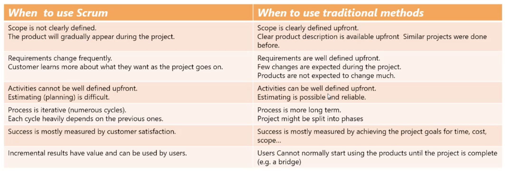

# 2.- Scrum theory and Values

## Introduction

Scrum is a framework within which people can address complex adaptive problems, while productively and creatively delivering products with possible value.

Scrum was designed to be aa framework not a process. This framework is lightweigjt, very sumple to understand but inherently difficult to master.

Scrum theory was founded or bases upon the *empirical process control*. At a very basic level, utilizing Scrum allows us to review, adapt and improve on an iterative level while producing value incrementally and optimizing predictability.

The Scrum framework consists of:
* Scrum Teams and their associated roles.
* Events.
* Artififacts.
* Rules. 

Each component within the framework serves a specific purpose and  is essential to Scrum's success and usage.

The rules of Scrum bind together the roles, events and artifacts, governing the relationship and interaction between them. the rules of Scrum are described throughout the body of this document.

## When to use Scrum

It is better to use Scrum if there are lots of unknowns, where the projects are more complex, difficult to define detailed requirements upfront and therefore to define estimates at he beginning os the project.

When to use Scrum VS traditional methods

## Scrum Theory

Scrum is founded on empirical proccess control, that knowledge comes from experience and making decisions based on what is know.

The three pillars uphold every implementation of empirical proccess control:
1. Transparency. Creates a mutual understanding of standards, a common language so that the process can be shared and undertood, and a transparent undertanting of the definition of done.
2. Inspection. Frequent inspection of the increments is highly important aspect of producing to spec and being done.
3. Adaption. The ability to adapt and change directions as needed. Adaption will occur as a result of the inspection.

## Scrum Values

The 5 values are:
1. Commitment. People personally commit to achieving the goals of the Scrum Team
2. Courage. The Scrum team members have courage to do the right thing and work on tough problmes
3. Focus. Everyone focuses on the work of the Sprint and the goals of the Scrum Team
4. Openness. The Scrum team and stakeholders agree to be open about all the work and the challenges with performing the work.
5. Respect. Scrum teams members respect each other to be capable, independent people

Successful use of Scrum depends on people becoming more proficient in living these five values. 

## Typical Scrum Timeline

### What happens prior to the Sprints?

1. The Vision Statement provides a concise description of the goals of the project which help the team stay focused on what is important from the organization point of view
2. The product Roadmap is an initial visual timeline of major oroduct features to be delivered and is normally created by the Product Owner.
3. Gather user requirements and turn them into deliverable features, these are called User Stories. User Stories are normally written by the Product Owner.
4. All these storires make up the Product Backlog. In Scrum we do not wait until the Product Backlog is 100% prepared with all the details to start the Sprints, we start the Sprint as soon as the Product Backlog is mature enough for the near future and keep updating the backlog all the way through the project.

### What are the Sprint activities?

5. Sprint Planning meeting are held to plan what will go into a Sprint (a fixed period of time used to deliver parts of the final product). The Product Owner prioritizies these requirements and therefore decides indirectly on the contents of the Sprint Backlog.
6. These stories (features, functionalities,...) make up the Sprint Backlog, so the Sprint Backlog is a list of all stories that will developed in the nest Sprint.
7. The Team break down (expands) thes stories into tasks.
8. The Team then takes 30 days or so to deliver an agreed amount of stories.
9. The Team holds a Daily Scrum meeting of 15 minutes each day to collaborate with each other.
10. At the end of the Sprint, the Team demonstrates the completed stories (products) to the customer in a Sprint Demo (aka Sprint Review)meeting.
11. The las activity is the Scrum Retrospective meeting, where the team reviews the Sprint and looks for ways of improving (lesson learned)

