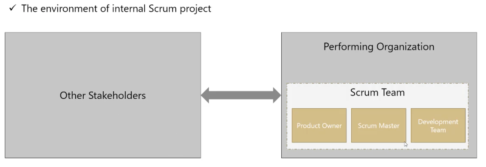
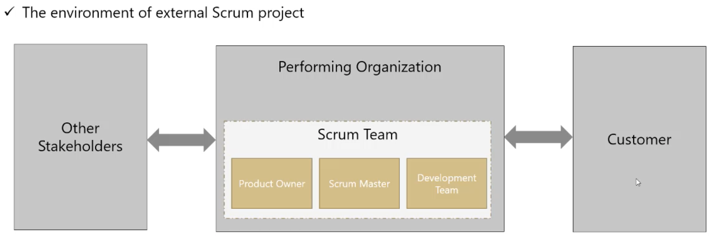

# 3. Scrum Roles

There are three roles in a Scrum project, no less and no more. We are not allowed to define any other roles, because it is hamful to the unity of the team ans it is not compatible with the philosophy of Scrum.

1. Producto Owner. 1 person business oriented
2. Scrum Master. Scrum coach and facilitator.
3. Development Team. 3-9 people, specialist.

The term *Scrum Team* refers to all the project team members, every internal to the project. Scrum Team members usually have only one of three standard roles.

The Scrum Team is a part of the performing organization (the performing organization is the company wich executes the project either for itself or as a contractor for an external customer)

Other person can also be involved in the project but they are not considered internal to the project and Scrum theory does not cover them much. They should have a certain set of behaviors though, to make it possible for a Scrum project to succeed.

When the project is not internal to the performing organization (you are not doing the project for youe own company), you should also consider the customer as another stakeholder. You may or may not have a separete customer, but you always have external stakeholders and should consider them in your development style

Scrum Teams are self-organizing and cross-functional
1. Self-Organized. The Scrum Team manages its own efforts rather than being managed or directed by others. In traditional methods, management efforts are separated and centralized. However, management and specialist efforts are not separated in Scrum.
2. Cross-Functional. The Scrum Team has all the expertise and competencies needed to get the job done without any help from outside the team.

These twi characteristics are designed to optimize flexibility, creativity and productivity, needed for the Agile environment of Scrum

## Product Owner

The Product Owner is responsable for maximizing the value of the porduct resulting from work of the Development Team. How this is done may very widely across organizations, Scrum Teams and individuals

The Product Owner is the sole person responsible for managing the Product Backlog, this includes:

* Clearly expressing Product Backlog items.
* Ordering the items in the Product Backlog to best achieve goals and missions.
* Optimizing the value of the work the Development Team perfomrs.
* Ensuring that the Product Backlog is visible, transparent, clear to all and shows what the Scrum Team will work on next.
* Ensuring the Development Team understands items in the Product Backlog to the level needed.

Product Owner should communicate with the customer and use the information to keep the Product Backlog updated with all the changes. They also measure the performance of the project, forecast the completation date and make this information transparent to all stakeholders.

Product Owner understand the business, so they can rank each Product Backlog item based on its return on investment as well as any other factor they find suitable for the business point of view of the project.

The items will be sorted based on their value, so the higher they are on the list and the sooner they will be developed by the Development Team.

## The Development Team

The Development Team consist of professionals who do the work of delivering a potentially releasable Increment of 'Done' product at hte end of each Sprint. A 'Done' increment is required at the Sprint Review. Only members of the Development Team create the Increment.

Development Teams are structured and enpowered by the organization to organize and manage their own work. the resulting synergy optimizes the Development Team's overall efficiency and effectiveness. Development Teams have the following characteristics:

* They are self-organizing. No one (not even the Srum Master) tells the Development Team how to turn Product Backlog into Increments of potentially releasable functionality.
* Development Teams are cross-functional with all the skills as a tema necessary to create a product Increment.
* Scrum recognizes no titles for Development Teams memebers, regardless of the work being performed.
* Scrum recognizes no sub-teams in the Development Team, regardless of domains that need to be addressed like testing, architecture, operations or business analysis.
* Individual Development Team members may have specialized skills and areas of focus, but accountability belongs to the Development Team as a whole.

Optimal Development Team size is small enough to remain nimble and large enough to complete significant work within a Sprint.

Fewer than three DEvelopment Team members decrease interaction and results in smaller productivity gains. Smaller Development Teams may encounter skill constraints during the Sprint, causing the Development Team to be unable to deliver a potentially releasable Increment.

Having more than nine members requires too much coordination. Large Development Teams generate too much complexity for an empirical process to be useful.

The product Owner and Scrum Master roles are not included in this count unless they are also executing the owrk of the Sprint Backlog.

It is highly recommended for members of the Development Team to work fulkl-time in a single project to stay focused and agile. The composition of the Development Team should not change so often. If there is a need to change team members, then change should not happen during a Sprint and there will be a short-term decrease in productivity when the composition of the team changes.

## The Scrum Master

The Scrum Master is responsible for promoting and supporting Scrum as defined in the Scrum Guide. Scrum Master do this by helping eveyone understand Scrum theory, practices, rules and values.

the Scrum Master is a servant-leader for the Scrum Team. The Scrum Master helps those outside the Scrum Team understand which of their interactions with the Scrum Team are helpful and which aren't. the Scrum Master helps everyone change these interactions to maximize the value created by the Scrum Team.

The responsibilities of the Scrum Master are not limited to the Scrum Team. They should also help those outside the Scrum Team understand the appropriate interactions with the Scrum Team to maximize the value created by the Scrum Team. the Scrum Master usually leads the organization in its effort to adopt Scrum.

It is possible for a single person to be both Scrum Master and a member of the Development Team, although this is not recommended. Being a Scrum Master of a project might not occupy 100% of the time of a person, in this cases, the best solution is to assign that same person as the Scrum Master in more than one project, rather than making them a member of the Development Team.

The Scrum Master service to the Product Owner in several ways:

* Ensuring that scope and porduct domain are understood by everyone on the Scrum Team.
* Finding techniques for effective Product Backlog management.
* Helping the Scrum Team understand the need for clear and concise Product Backlog items.
* Understanding product planning in an empirical environment.
* Ensuring the Product Owner knows how to arrange the Product Backlog to mazumize value.
* Understanding and practicing agility.
* Faciliting Scrum events as requested or needed.

The Scrum Master serves the Development Teams in several ways:

* Coaching the Development Team in self-organization and cross-functionality.
* Helping the Development Team to create high-value products.
* Removing impediments to Development team's pregress.
* Facilitating Scrum events as request or needed.
* Coacing the Development Team in organizational environment in which Scrum is not yet fully adopted and understood.

The Scrum Master Service to the Organization in several ways:

* Leading and coaching the organization in its Scrum adoption.
* Planning Scrum implementations within the organization.
* Helping employees and stakeholders understand Scrum and empirical product development.
* Causing change that increases the productivity of the Scrum Team.
* Working with other Scrum Masters to increase the effectiveness of the application of Scrum in the organization.

