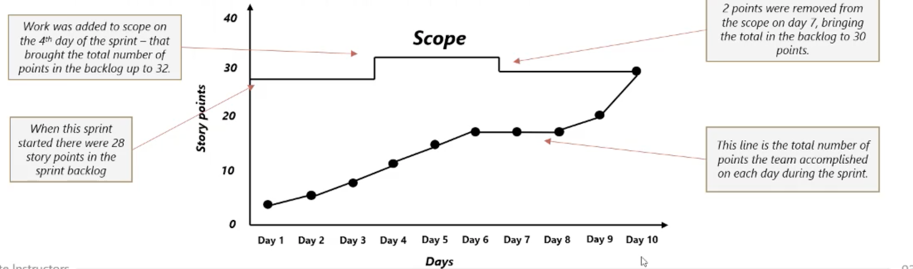
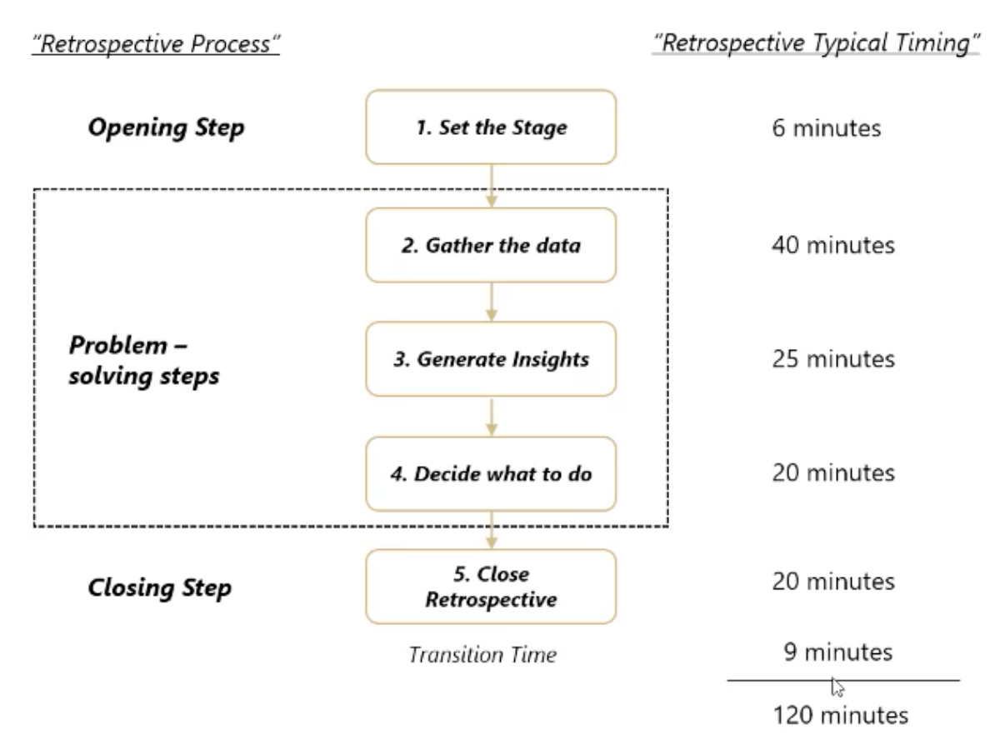

# 6. Managing Projects with Scrum

## User story and story points

A user story is a very short description of a specific thing that users need. a lot of teams write them on index cards or sticky notes. By organizing all of their work around user stories, Scrum teams make sure they keep user needs front and center in their planning and prioritization process.

it can also be defined as a small chuunk of business functionality within a feature that involces a 1-3 days of work

During the planning for an agile project, the Product Owner will work with end user to identify user stories. Those stories identify the user's needs and their rationale for asking for the feature. Here is how they do it (3 C's of user stories):
1. Card. Just enough text to identify the story. First the product owneer writes down the user story and that card reminds them to understand the detail of what needs to be built.
2. Conversation. When its time to stimate the story, the development team has a conversation with the product owner and sometimes the users to figure out the details they need to know to stimate the card.
3. Confirmation. the team turnns their attention to the tests they will write to make sure they user story has been built. This confirmation is an important feedback loop and the fact thar user stories are small and self contained hekps both the team ans users agree on the tests to run.

Some teams will write the teest that confirm each usere story on the back of the user story card. that helps the team to remember how the story should work when its done. It also helps the users and the team come to an agreement on how the story will behave when software's ready.

The guidlines for wirting a good user story can be summed up with the acronym __INVEST__:
* Independent. User stories should be able to be described apart from one another.
* Nagotiable. All of the festures in a product are the product of negatiation.
* Valuable. There is no reasson to spend time writing a card that is not valuable to your users.
* Estimable. Each user story needs to convey a feature that the team can assign as size of effort number.
* Small. User stories should describe independent interactions,. not huge categories of functionality.
* Testable. Being able to test each user story is what makes it such an effective feedback loop for Scrum teams.

Story points are the unit of measurement for expresing the overall size of a user story and their associeted effort.

Because story points represents the effort to develop a story, a team's estimate must include everything that can affect the effort. That could include:

* The amount of work to do
* The complexity of the work
* Any risk or uncertainty in doing the work.

Following are some points to consider when dealing with story points:

## Plannign Poker

Once the team has a prioritized list of user stories to get started with they need to figure out how much effort it will take to build them. they usually estimate the story points needed to build each story out as poart of the Scrum planning meeting at the start of each sprint.

Most often the team knows which stories are the highest priority by looking at the backlog, so they try to commit to as many high priority stories as they can in each sprint. One way the team does this is planning poker.

Most teams will hold a Planning Poker session shortly after an initial product backlog is written. this session (which may be spread over multiples days) is used to create initial stimates useful in scoping or sizing the project.+

Because product backlog items will continue to be added throughout the project, most teams will find it helpful to conduct subsequent estimating and planning sessions once per sprint. Usuarlly this is done a few days before the end of the sprint and immediately following a daily stand-up, since the whole team is together at that time anyway.

Planning poker can be performed through six steps:

1. The setup:
   * Each team member has a deck of cards with valid estimation numbers on each card. Usually the Scrum master moderates this session.
   * When the team cant be in the same room to use cards, the team will agree on the point scale they are going to use up front and a method for communicating estimates.
   * Many distributed teams will have everybody give their estimates over an instant message system to the moderator instead of using physicals cards.
2. Understanding each story. The team goes through each story in the sprint backlog in priority order with product owner and ask questions about the story to figure out what the users need.
3. Assigning a story point value. Once the team has discussed the feature, each person assigns point value by choosing a card from the deck and shares that value with the group.
4. Explaining the high and low numbers. If the estimates differ between tema members, the high number and the low number explain theri estimates.
5. Adjusting the estimates. Once the team has heard the explanations, they have a chance to choose an estimation card again. If the team cant be in the same room, they communicate their estimate through email to the moderator without sharing it out loud to the team.
6. converging on an estimate.
   * Usually, teams start with a significant range of estimates but the team narrows, over the course of explanation and adjustment. After few iterations over this process, the estimates coverage on a number that the team is comfortable with.
   * It usually takes only 2-3 iterations of discussing until the team can anonymously agree on a story point value.

Planning poker is very effective, in part because it is collaborative. When the team estimate effort for an item, each team member estimates the whole effort, not just his of her part of it. so even if you are not doing the work, you are estimating it... and that helps everyone on the team to get a better understanding of the whole project.

## Velocity in Scrum

Velocity is an extremely simple, powerful method for accurately measuring the rate at which Scrum development team consistently deliver business value. To calculate velocity of your Scrum team, simple add up the estimates of the features, user stories, requirements or backlog items succesfully delivered in a sprint.

There are some simple guideline for estimating initial velocity of your Scrum team to completing the first Sprint but after that point you should use proven, historical measures for planning features.

Within a short time, velocity typically stabilizes and provides a tremendous basis for improving the accuracy and reliability of both near-term and longer-term planning of your Scrum projects. Scrum delivery cycles are very small so velocity quickly emerges and can be validated very early in a project and then relied upon to improve project predictability.

Velocity is the sum of the estimates of delivered features per sprint. Measured in the same units as feature estimates, whether this is story points, days, ideal days or hours that Scrum team delivers - all of which are considered acceptable.

How to measure the velocity?

Your Scrum team planned to tackle 41 story points in their first sprint. They completed 28 story points and rolled 13 story points over to the next sprint. So their velocity is 28.

Note that we are not counting any partially-completed work towards the team's velocity. Only tasks marked as 'Done' count, even if there's only a tiny bit of work left to do in the task.

So fas, we know that the team fell short of their target for how much work to complete in the sprint. But we are not really sure far short they fell.

Over one sprint, velocity is not a very useful metric for making predictions, but it does give the team a sense of how much work they can commit to in a single sprint. Let's track their progress for a few more sprints.

This average, over just four sprints, is already much more useful than the snapshot we has after just one sprint. It is easy to image how, with a backlog of already-estimated user stories, we could use this velocity to make ecudated guesses about what features we'd be abale to deliver in upcoming releases.

Velocity works best with long-lasting, stable teams which have lots of experience of working together.

## Task Boards

Scrum try make it easy for team members to make decisions at the last responsible moments by giving the whole team constantly updated information about how the sprint is progressing.

Most teams start by making a whiteboard with three columns:
* To DO
* In Progress
* Done

As a team start working on a story, he or she will move it from the To DO column to the In Progress column and the Done column when it's complete.

Sprint Begins. All of the user stories are in the To Do column because no one has started working on them yet.

Mid Sprint. The team members moves their tickets to In Progress when they start working on them and to the done column as they are completed. The team usually agrees to a definition of done up front so that everyone is clear on what it means to be done with a story.

Sprint Ends. If the team estimated well, all the user stories they put in the backlog have been moved to the Done column. If there are leftover user stories, they are added to the next sprint backlog.

Information radiators use highly visible charts or graphs that 'radiate' information about the project quickly to anyone who is interested. Task boards are of the most commonly used information radiators in Scrum projects.

## Burn Charts

Once a team has assigned a story point value to all of the user stories in the sprint backlog, they can use burndown charts to get a handle on how the project is progressing.

A burndown chart is a simple line chart that shows how many story points are completed each day during the sprint. The burndown chart gives eerybody a clear sense of how much work is ledft to be done anytime. Using a burndown chart, it is clear to everyone on the team how close they are to achieving their sprint goals.

Burndown charts and velocity help the whole stay in control of the sprint.

At the end of each sprint, you can count the total number of story points that have been accepted by the product owner and this number of points per sprint is the velocity.

May teams plot their velocity per sprint as a bar chart so they can see how they did across multiple sprints. since each teams's scale for estimating story points is different, you can't use velocity to compare teams to one another. But you can use it to hep figure out how much work your team shoul commit to based on their past performance.

Sprint velocity. This is a bar chart of the total number of story points completed in each of four sprints. If the team is using the same scale for estimation in each sprint, you can use this number to compare how much work has been done from sprint to the next. To create this chart, the team just adds up the number of story points in the dione column of the task board at the end of each sprint.

Sprint velocity with committed points. This is a bar chart of the total number of story points the team put into the sprint backlog in grey and the number they actually completed in black. to create this chart, the team just adds up the numbner of story points in the sprint backlog after the planning session and marks thar as the commited number. At the end of the sprint they track the velocity number by adding up all of the story points in the Done column of the taskboard+

Another way to track your progress during a print is to use a burn-up chart. Instead of subtracting the number you have completed from the number you committed to, burn-ups track a cumlative total throughout the sprint and show the total committed scope on a separate line.

When stpories are added or deleted from the scope its obvious by looking at the scope line. when stories are put into the done column on the trask board, that's easy to see too, by looking at the total number of points burned up in the sprint. Because the scope is tracked on a different line from the number of points accomplished, it is cleared when the scope is changing

## Backlog Grooming

The product owner's role on a sprint team is keep everybody working on the most important thing in every sprint. They are in charge of the order of stories in the sprint backlog and the product backlog. When the team has questions about a user story, the product owner is the one tracks down the answers

Many teams set a time near the end of each sprint to make sure that the backlog is in order before the team starts to plan the next sprint. That meeting is called the product backlog refinement meeting.

Product backlog refinement is all about adding detail and estimate to each backlog item and revising the order. Teams usaurlly rely on the estimation that they do during sprint planning, but should feel comfortable re-estimating product backlog items anytime.

This is a collaborative effort between the product owner and the development team -  and it is focused entirely on the product backlog. Once the refinement meeting is over, the product owner has a couple of days before the start of the next sprint to follow up on any open questions and make sure that the priorities make since to business stakeholders as well.

Some teams refer to product backlog refinement as PBR. In general, teams typically spend less than 10% of their time doing this.

## Story Maps

One way to visualize the backlog is to lay it out in a story map. A story map is a high level planning tool that Scrum stakeholders can use to map out the project priorities earlky in the planning process, based on the information available at that point.

Story maps start by identifying the most core features of your product as its backbone. then that functionality ois broken up into the backnone's most important user stories. Those are called the walking skeleton. You first sprints should be focused on delivering as much as of the walking skeleton as possible. After that you can plan your releases to include features in their prioritized order on the map.

## Retrospective

The importance of taking the time for retrospection comes from one of the twelve core principles of the Agile Manifesto. At regular intervals, the team reflects on how to became more effective, then tunes and adjusts its behaviour accordingly.

At the end of each sprint, the team reflects over the experience they just had works together to fix any issues that came up. Retrospective help your team stay aware of how things are goiing and stay focused on making things better with each sprint.

Considering the prime directive, there are four key questions in a retrospective, which can also be used when creating your meeting agenda:
1. What did we do well, that if w don't discuss we might forgot?
2. What did we learn?
3. What should we do differently next time?
4. What still puzzless us?

A retrospective is a process and it goes through a series of steps. It's depicts a two-hour retrospective with time spread across the five steps.

There are three types of retrospective:
1. Sprint Retrospective. Usually focused on the team involved in the sprint.
2. A Release Retrospective. A wider perspective because it may involve other people in the organization who have contributed to the release but are not part of the core team.
3. A Project Retrospective. Also has a wider perspective and is usually from an organizational point of view.

Stage 1. Set the Stage

Here the timebox(how much time), goal (what you are going to do), approach (how you are going to do it) and work agreements or ground rules are set. Setting the stage is all about settings the tone of the meeting and getting the team on board. Tools and techniques to help you set the stage:
* Check in. In this technique, we hope that people put aside their concerns and participate in the retrospective articulating what they want from it. The retorspective leader asks inly one question ans each person answer in round robin fashion. The answers are usually in one or two words or a short phrase. Example questions can be:
  * In a word or two, what you expect from the retrospective?
  * What is one thing in your mind as we begin the retrospective.

* ESVP. In this case, the team anonymously identify their attitude towards retrospective as one of the four designations, Explore, Shopper, Vacationer or Priosioner.
  * Explorer is someone who is eager to know new ideas and insights.
  * Shopper is the participant who looks over all information but is happy to go home with one useful new idea.
  * Vacationer. is the participant who is not interested and happy to be left out.
  * Prisoner. is someone who thinks that he or she has been forced to attend the meeting and should be doing something else.

In the ESVP exercise, each retrospective participant anonymously writes down his or her position and puts it on a slip of paper or index card. Next, the leader takes the responses and put them into a histogram or a check sheet.

After the results have been collected, you should tear up the cards so that no one is worried about being tracked with handwriting analysis. With this information, you will have a good idea of how your audience feels about the retrospective. This exercise informs about the participoants attitudes in particular.

Stage 2. Gather Data

Once the stage has been set, the next step is to gather data. Start with hard data such as metrics, events that've happened or stories completed. Creaste a visual record having events, story completion, date, etc. The visual data by asking questions such as *When were the poarticioants exited to come to work?*. Tools ans techniques to hekop you gather data:
* Timeline. A timeline is used to stimulate memories of what happened in the time period that just passed. The retrospective participants write down memorable and meanningful events on sticky notes and paste them in chronological order on a bord. A sample example is shown below, which in this case is for a sprint.
* Mad, Sad, Glad. Here you have three posters labelled - *Mad, Sad and Glad*. You can also have color-coded cards or stiky notes. For example: red for mad, yellow for sad and green for glad. The team members then put the color-coded cards on the labelled posters and describe times during the project when they felt mad, sad or glad. This exercise gets the feeling fact out on the table.
* Triple Nickels. The teams sits in a circle. If the team is too big, you make 2 or more circles. Each team member writes its ideas about the topic you are brainstorming. After 5 minutes, everybody give its paper to the person on its right. that person will then read the thinking of its colleage and complete or responds. After 5 more minutes, they move again the papers to their right and we continue the process until the papers come back to their original writes.

Stage 3. Generate Insights

After you have gathered the data, it's time to evalute, analyse the data and provides insights. This step tells the *why*.these insights heko the team to work more effectively and efficiently. Tools and techniques to help you generate insights:
* Fishbone. The team use this diagramming tool to display the root cause of a problem. Using this technique, the team identites factors that are causing of affecting a problem situation and look for the likely causes. The process starts with drawing an empty fishbone diagram and writing the problem at the head of the fish. the next step is to identify categories of contributing factors, which are also written on the diagram.
* Prioritize with dots. In this technique, each team member will be given 10 dots to stick on the issues that they want the team to attempt to address first. then choose the issues that have the most dots to focus on in the *Decice what to do* phase of the retrospective.

Stage 4. Decide What to Do.

This step reveals the *what to do* part or the planning part . If you have a long of decision action items, choose a few, which the team can commit to doing. A good, way to have the action items implemented is to create story cards or backlog items and have them available in the product backlog. Ensure that you assign actions items because it drives commitment.

After the data has been evaluated and the team have the insights into the issues, they must decide how to rectify them. The technique called *circle of questions* can be used to give individuals opportunities to provide solutions where a person picks an issue and the next person proposes a solution. Tools and techniques to help decide what to do:
* Short subjects. To sort the issue the team can use an action wheel where each item is categorrised choosing:
  * What went well, do differently next time.
  * Keep, drop, add.
  * Stsart doing, stop doing, do more of, do less of.

Stage 5. Close the retrospective.

The final stage of the retrospective is formally closing it. Here, we have the opportunity to reflect on what happened during this retrospective and express our appreciation to each other. Tools and techniques to help you close the retrospective.
* Plas Data. What they want to do more of and want to change. This technique is used to retrospect on the ongoing retrospective and identify areas os strength and areas needing improvement. It starts with frawing a 'T' on a white board, divided the space into two parts, '+' and 'delta'. the items that the team should do more of should be listed under '+' ans ones that can be changed by the next retrospective are put under 'delta', which is the alphabet meaning 'change'.

## Spikes

Spikes are a key tool that scrum teams use head off problems and resolve them as early as possible. A spike is a short effort that is devoted to exploring an approach, investigating an issue or reducing a project risk.

Although spikes can be done at any time during a project, they often take a form of bried exploratory sprints or proof of concept efforts that are done at the start of the project, before development efforts begin.

Now, defining two terms for specialized kinds of spikes:
1. Architectural Spike. It is a short, timeboxed effor dedicated to 'proof of concept'. In other words, checking whether the approach the team hopes to ues will work for the project.
2. Risk Based sprike. Is a short timeboxed effort that the team sets aside to investigate and hopefully reduce or eliminate an issue or threat to the project. these short experiments to investigate risky portions of the project are key tool for risk management.

## Technical Debt

Technical debt is the backlog of work that is caused by not doing regular clean up, maintenance and standardizartion while the product is being built.

It is a backlog of things that should be done to make work easier in the future, but are not done because of a push to deliver features.

You can thought of technical debt as inflated cost of change curve. It increases the cost of development and making changes in the future because we will have to do all standardization and clean up work that has been put off.

In software projects the solution to technical debt is refactoring. Refactoring is the process of taking time to simplify and standardize the code to make it easier to work on in the future.

When asking agile teams for estimates, always ask them to include time for refacotring, since this should be part of their regular work routine.

To keep technical debt as low as possibler, refactoring should be done frequently. we dont need to save it up to a refactoring sprint, instead we incorporate it into all out regular work.

One analogy we can use for technical debt is the preventive maintenance, taking time to refactor the work, sort things out, and standardize and simplify it will enhance the team's ability to produce more features in future.

## Cone of Uncertainty

Uncertainty in the Product Backlog is a big risk for the schedule of a Scrum project. The problem is that the full scope of the release can be quite hard to estimate because the requirements are not wellknow early on. Confounding this problem is that frequently the release date is a hard deadline.

This means that a scrum team must perform an unknwon about of work in a fixed amount of time. the 'Cone of uncertainty' describes the reduction of the uncertainty about scope afeter each sprint. At the uncertainty is eliminated and the exact amount of scope is known.

In anticipation of scope problems, the software development schedule should be aligned to address the highest priority festure sets ans features in early sprints and defer lower priority feature sets and features to letar sprints.

To reduce the cone of Uncertainty and the risks around missing a release deadline further, the requirements lead and the Scrum team should actively defer low priority feature from all features sets to lateer sprints.

This avoid the cases of being unable to release a minimally acceptable product because time was spent on low priority user stories / features from high priority feature sets when it could have been spent on all individually high priority features across feature sets.