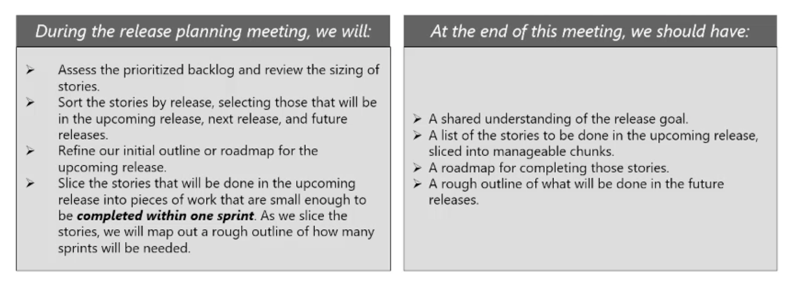

# 7. Value Driven Development.

## Assessing Value

Business value is usally assessed ibn finalcial terms, stsarting with assessing the value of potential porjects before they are approved to proceed.

For business projects, value is commonly estimated using financial metrics such as return on investment(ROI), internal reate return (IRR) and net present value (NPV)

Using financial formulas to assess the value of a project removes individuals bias and emotion from the process of seleccting and justifying projects.

1. Return on Investment (ROI). the ration of the benefits received form an investment to the money invested in it, expressed as a percentage.
2. Present Value (PV). a way of calculating the value of a future amount in today's teerms, given an assumed interest rate and inflation rate.
3. Net Present Value (NPV). The present value of a revenue stream over a series of time periods, such as months or years.
4. Internal Rate of Return (IRR). This discount rate at which the project inflows and project outflows are equal.

## Managinf Risk

To maximize value, scrum teams need to consider risks and technical dependencies. Therefore, we need to consider risks and nonfunctional requirements and let customer know those elements will impact the project.

We can think about threats as anti-value, factors that have potential to remove or reduce value if they occur. To maximize value, we must also minimize risks on the project.

For scrum purpose, a risk is potential event of circumstance that could have a negative impact in the project and it is important to engage the development team in risk analysis as they have unique insights into the risks since they are closer to the technical skills.

the primary tools scrum teams use to manage risks are the risk adjusted backlog and risk burndown charts.

## Prioritizing value

Value Based Prioritization is a technique used in scrum projects as a part of the value dirven delivery. In terms of agile project management, prioritization is the process where customers organize / select product backlogs / user stories for implementation based on the perceived values. It is the act of deciding in what order the team should start working on the requirements.+

Factors that will effect the prioritization:
1. Financial value delivery by features.
2. Cost of developing the new features.
3. Amount and significance of learning and new knowledge while developing the new features.
4. Amount of tisk remoed by developing the features.

The product owner should continuously assess the product backlog and prioritize its stories based on their customer value. Determining customer values include activities such as collaborating with customers, creating focus groups and reducing techniquel debt.

the customer and the product owner is responsible for keeping the items in the backlog prioritized by business value.

Customer-valued prioritization is an ongoing process throufhout the project. Typically, the team will sit down with the customer at the end of each iteration to prioritize the remaining work items.

There are no specific scheme that is best for scrum projects, but there are some common prioritization schemes used on scrum projects. I am listing below the commonly used ones:
1. Simple Scheme. One of the simplest scheme is to label items as 'Priority 1', Priority 2',..
2. MosCoW. In this technique, requirements are prioritized based on Must, Should, Clould and Would not.
3. Monopoly Money. You need to give stakeholders Monopoly money equal to the amount of the project budget and ask them to distribute those funds amng the system features.
4. 100-point method. In this method, each stakeholders is given 100 points that he or she can use to vote for the most important requirements.
5. Dot Voting. Here, each stakeholder gets a predetermined number of dots to distribute among the options presented.
6. Kano Analysis. this technique strive to fulfill requirements and ensure customers satisfaction. Under this technique, requierements are prioritized based on Basic Needs, Performance Needs and Excitement Needs.
7. Requirements Prioritization Model. This technique is based on the premise that the feature that have the hifhest benefits after adjustment of cost, risk and penalties should have the highest priority.
8. Relative Prioritization / Ranking. simple, ask the customer to list features in order of relative priority.

## Delivering Incremently

The term *minimal viable product* or MVP refer to this package of functionality that is complex enough to be useful to the users or the market, yet still small neough that is does not represent the entire project.

For a cell phone, for example, a minimal viable product could be a phone that can be used to make and receive calls, store contact names and numbers and access voice mail, but does not hace camera, internet connectivity or a music player in the first release.

However, the functionality of the phone that is released in the MVP needs to be complete. so all the attributes related tio makinfg phone calls should be present as part of the MVP to allow the customer to comprehensively review the functionality.

## Work In Progress

Sometimes it is know as 'work in process' is the term given to the work that has been started but has not yet been completed. Excessive levels of WIP are associeated with a number of problems includinf:
1. WIP consumes investment capital and delivers no return on the investment until it is converted into an accepted product. It represents money spent with no return, which is something we want to limit.
2. WIP hides bottlenecks in processe thar allow overall workflow and masks efficiency issues.
3. WIP represents risk in the form of potential rework, if there is a large inventory of WIP, there may be in turn be a lot of scrap or expensive rework if a change is required.

Agile approaches generally aim to limit WIP. A common way to apply WIP limits on Scrum projects is to use Kanban / Task boards.

The boards can indicate WIP limits by displaying a present number for how many tasks should be worked on at any given time or to restrict the amount of space designated for where the task card can be placed on the board so only a selected number of cards will fit into the space.

## High Level Planning

Scrum projects are divided into releases and sprints. A sprint is a short timeboxed development period, typically one to four weeks in duration. A release is a froup of sprints that results in the completion of valuable deliverable on the project.

we start planning releases and sprints early in the project lifecycle and progressively refine the planning effort multiple times as the project progresses.

Before we start planning the first release, we need to complete a high-level visioning process. This includes identifying and roughly sizing the product features and user stories.

The participiants in the high level estimating process are likely to include the product owner and sponsor as well as key members of the delivery team and possible other stakeholders. This differs from the later more detailed stages of agile estimating, which primarily done by development team.

A product roadmap is a visual depiction of the product releases and the main components that will be included in aeach release. This is a communication tool that provides project stakeholders with a quick view of the primary release points and intended functionality that will be delivered.

The product roadmap shows what we plan to deliver in each release, so in planning each release, we will go back to the roadmap and confirm that the basic plan still work or make any necessary adjusments.

## Release Planning

Release planning is done in a meeting in which all the stakeholders are represented, such a meeting is held before we start work on each new release. The goal of this meeting is to determine which stories will be done in which iterations for the upcoming release and in less detail, for the subsequent releases.
 

Releases are planned around delivering useful and valuable functionality to the customer. A release may be data driven or functionality drive.

## Sprint Planning

Sprint planning begins with a meeting that includes the delivery teams, the product owner and possible other stakeholders or subject maters experts as needed.

In the first half of the meeting, the product owner describe the backlog items they would like to see developed in the first sprint and based on that, the team members select a set of items that they think are achievable. In the seconf half os the meeting, the team breaks down the selected backlog items into the smallest unit of work to come up with a list of action items for the sprint.