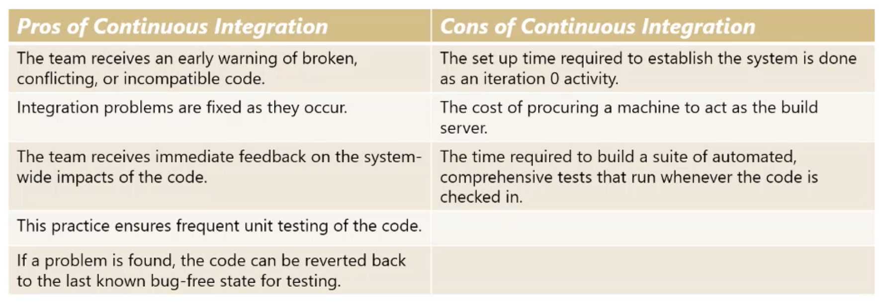
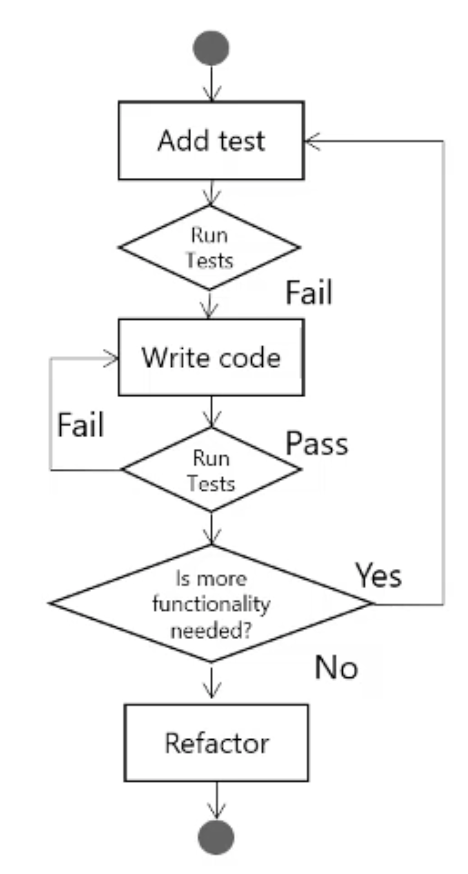
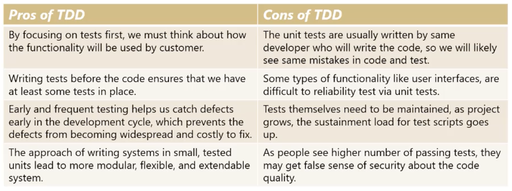

# 8. Development Concepts and Practices

## Testing in Software Development

In software development projects, the goal of frequent verification and validation is to fins issues as soon as possible and keep them low on the cost of change curve. There are two commonly used and specialized kinds of testing - exploraty testing and usability testing.

Exploratory testing relies on the tester's autonomy, skill and creativitivy in tryin to discover issues and unexpected behaviour. This is a complement to scripted testing.

Scripted testing follows a path that is written by tester themselves or someone else. the script includes test cases and test steps that are documented. There can be no deviation from the path laid out in the script.

A team will interwaeve exploratory testing with scripted testing to help find edge cases, system boundaries and unancitipated behaviour outside of the regular functions that can be tested with scripts.

Usability testing answer the questions,*How will an end user respond to the system under realistic conditions?* The goal of this kind of testing is to diagnose how easy it is to use the system and help uncover where there are problems that might need redesign or changes.

## Continuoes Integration

It is a practice used by software developers to frequently incorporate new changed code into their project code repository. This helps minimize the integration problems that result from multiple people making incompatible changes to the same code base.

Continuous integration is one of the tools we can use to find and resolve problems as early as possible. It uses automated tools to start the itegration process automatically whenever new code is checked in or at time intervals. The components od a continuous integration system are:

1. Source code control system. This is a software that performs version control on all the files that represent the product being deployed.
2. Build tools. The source code needs to be compiled before tests can be run. Most integrated development environmets serve as a build tool to compile the code.
3. Test tools. As part of the builf process, unit tests are run to ensure that the basic functionality operates as planned.
4. Scheduler or trigger. Builds might be launched at regular schedule or every time the system detects a change to the source code.
5. Notifications. If a build fails, the team needs to be notificated so they can correct the build as soon as possible.

Table below explains the pros and cons of the continuous integrations

## Test Driven Development

The philosify of TDD is that tests should be written before the code is written, developers will think about how functionality should be tested and then write tests before they begin developong the code. Initially tests will fail, since developers have not yet written the code.

So with TDD, developrs begin a cycle of writing code and running the tests until the code passes all the tests. Then, if necessary, they clean up the design to make it easier to understand and maintain wihout changing the code's behaviour. This is called refactoring.

These tools will tell the team whether the code passed or failed by communicating a green or red status, this known as 'Red, Green Refactor'.

Table below explains the pros and cons of the test driven development(TDD)

## Acceptance Test Driven Development

This testing technique moves the focus the testing from the code to the business requirement.

Typically, we capture these tests when we pull the user story from the backlog and discuss its desired behaviour with the business representatives.

The overall process goes through the four stages of discuss, distill, develop and demo.

1. Discuss the requirements. during the planning meeting we ask the product owner or customer questions that are designed to gather acceptance criteria.
2. Distill tests in a framework friendly format. Here, we get the test ready to be entered into our aceptance test tools. This usually involves structuring the test in the table format.
3. Develop the code and hook up the tests. During development, the tests are hooked up to the code and the acceptance test tool. This usually involves structuring the tests in the table format.
4. Demo. The team does exploratory testing using the automated acceptace testing scripts and demos the software.

## Scrum and DevOps

DevOps is an organizational concept serving to bridge the gap between development and operations, in terms of skill, mind-set, practices and silo-mentality. The underlying idea is that developers are aware of and in daily work consider implications on operations and viceversa.

DevOps three way are the set of underlying principles that make up DevOps. DevOps three ways is based on lean thinking and systems thibnking. DevOps three ways work with Scrum as the three ways is not about specific tools and practices that are often more emphasized during any discussion about DevOps in the communities.

Scrum Teams adopting DevOps Three Ways will have different way of working with Scrum Teams who are not adopting it. None of the DevOps Three Ways are in conflict with the Scrum Framework and Scrum values.

1. Optimze Flow. In DevOps, we are concerned about optimizing the flow of single Product Backlog Item since the first time customer requested it until the customer get the requested PBI in forms of tangible item in the product environment. When the Scrum Team decides to adopt a flow-based model. the Scrum Master needs to learn about flow-based models and coach the whole Scrum Teams on how Scrum works with flow-based models. Anything that gets in the way of make the PBIs flows smoothly in the value stream may be a bottleneck that should be removed. Many people in the Agile communities believe that flow contradicts Scrumps Sprint because the premise is:
   * You plan fro the whole PBI need to be completed for the Sprint during the sprint Planning. The Sprint is a commitment.
   * You can only deliver to production once after the Sprint Review.
2. Amplify feedback. At its core, Scrum has the Sprint and the Daily Scrum as a built.in feedback loop. Scrum Teams adopting DevOps will have a different nature of implementing the feedback loops. Scrum Teams implementing eXtrem Programming have multiples feddback loops with pair programming and Test Driven Development as the smallest feedback loops.
3. Maximize learning and experimentation. the third way is maximize learning and experimentation. The heart os Scrum ois about continuous learning because Scrum is based on empiricism. Empericism asseets that knowledge come from experience and making decision based on what is known. The porpose of having Sprints is to maximize learning and to improve how Scrum Teams will operate and deliver value in the next Sprint.

Sadly, many organizations without a clear understanding of Scrum values and principales will treat the Sprint as a mini-waterfall and will the scope for the Sprint without any rooms for the Scrum Team to innovate or to learn something new. The Scrum Master is the role that is responsible to ensure that the organization has a culture of learnings.

DevOps is not about tools and automation in the delivery pipeline. Overall, DevOps is about collaboration and collective ownership. focus on the flow of value delivery and learning and experimentation culture. But sadly, manu tooling vendors position DevOps as tools and process for delivery pipeline. This wioll get the management exicted because amny managers whom I've met think that after buyig and installing the 'DevOps' tool without changing their organization will make their company instantly Agile. This is like putting the cart in front of the horse.

## Pair Programming Concept

A lack of defined engineering practices, standards and tooling is an often observed problem in software development, regadless of wheter Scrum is used. It reflects the appalling lack of attention to technical excellence in out software development industry. In a context of Scrum, it is even more estranging. Scrum does not predefine any of such practices, but Scrum cannot be emplpoyed to its full extent if they are lacking.

Scrum implements empericism, the process of frequent inspections and adaptions. Inspections happen against standards, agreements, goals and exceptions. Inspections are done by those having skin in the game. When employing Scrum for software product development, a team can't operate effectively without well-defined development standards and practices.

Pair Programming is about quality in the first place. It's certainly not about the opportunity to always workk with one's best freind. And pair programming is also not about 2 people writing the same code. Much of the success of pair programming, in how we have experienced it, lies in the roles and rotation of pairs.

### Roles and rotations
sprint Backlog is made up of forecasted functionality and its decomposition in development work. A good practice we use is to have team members take the 'lead' in seeing a Product Backlog item being created end-to-end.

At the start of the day the pairs are formed, holding that the leads for right 'partner' to work with on the development work that lies right ahead. After lunch the pairs are rotated. The lead once again looks for the right 'partner' to work during the second half of the day. This rotation offers team members the opportunity to get the best possible help for any given problem every half day.

Within the half day that a pair works together, they take up a second set of roles. The person holding the keyboard and mouse is called the 'driver'. The second person is the 'navigator'. The driver focuses on writing code, while the navigator minds respext for the overall direction and design. within the half day the pair works together, the roles of driver and navigator are switched frequently. The control over mouse and screen frequently goes from the one to the other and back. It depends on the specific code being written, whether either of them has done this already before, whether someone has a great idea.

The sepatation of driver and navigator assures that activities that a single programmer would do in a sequential way anyhow are performed in a parallel way. the persin minding the road, writing code, gets immediate feedback, even while the writing is happening by the navigator who is minding the overview, the overall direction.

### Cost of pair programming

Doiung work in parellel that otherwise would be perfirmed sequentially explains why pair programming has no higher cost than single programming. The driver and the navigator don't perform the same work. There is no additional overhead created neither and the nasty effort of reworks is prevented. Waste is prevented.

### Quality

As an organization, pair programming should be promoted for reasons of quality first. Early studies found a decrease in defects and reowrk with 60% and more. so, even if initial budget would be +10%, which I defy, the decrease of rework alone makes it more than wothwhile, from a total cost perspective. Pairs alfo produce less lines of code to get the same functionality to work. They create lighter applications with lighter architectures that are easier to maintain.

## Mob Programming Concept

Mob Programming takes Pair Programming a step futher. With Pair Programming two developers share one workstation, working on one item. The developer behind the keyboard is called the 'driver'. The other developer is called 'navigator'. Both are actively engaged with the job at hand and switch roles regulary.

Mob Programming has the same rules,. but now the whole tema shares one workstation and works on one item together. As with Pair Programming one person is the driver. The others are all navigator. Also with Mob Programming the participants switch roles often.

Ideally all the activities is a very interesting way to create software where the whole team is focused on one workstation. It does bring many benefits Scrum finds important.

Mob Programming is a very interesting way to create a software where the whole team is focused on one workstation. It does bring many benefits Scrum finds important:
1. The Development Team owns the item and kointly creates a 'Done' increment.
2. The Development Team is in a perfect position to embrace the Scrum Values of openness, commitment, courage, focus and respect.

## Code Reviews Concepts

Code review is the process of letting a person other than the original code developer inspect or review code. Some developers do review their own code before checking their new changes.

Code review can be done both formally and informally. You can do them in differents steps of the software production life cycle. and they can be done by either developers or by members of a QA team.

In companies with more resources, large and disciplined teams try to practive formal code reviewin. Formal code reviewing was broadly introduced by IBM's Michael Fagan 1986 and has 7 different steps practiced by 3 or 4 people.

As an alternative, there is lightweight code review, Its more popular in agile teams because it is less expensive and is still an effective method to minimize bugs and improve source code quiality.

Lightweight code review is usually done by one or several of the following methods:
1. Practicing pair programming
2. Having over the shoulder review sessions ofr discussion and inspection
3. Sending code via mail and asking for reviews
4. Using third party tools to let developers share and give feedback

Performing oeer code reviews in an ad-hoc, informal way is also effective because it lets developers adopt the best method for themselves and their teams based on their culture and resources.

OF the many agile code reviews benefits, these are the situations where we find it especially efficient and effective:
1. Detecting functional defects and unit test mistakes.
2. Detecting design and coding structures defects.
3. Detecting readability issues and coding convention defects
4. Sharing technical knowledge and codings tips
5. Mentoring new team members.

